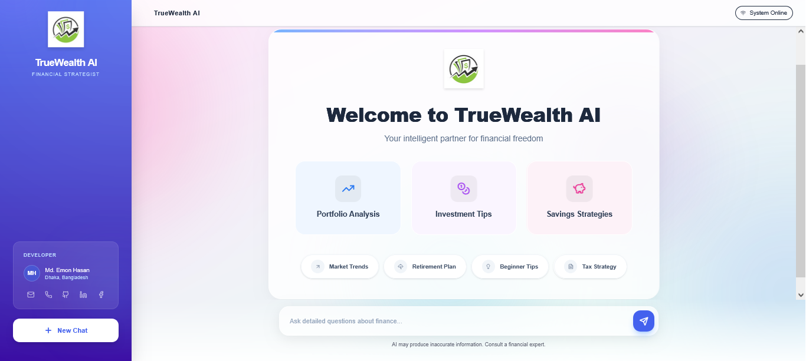
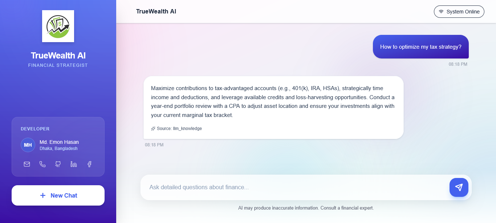
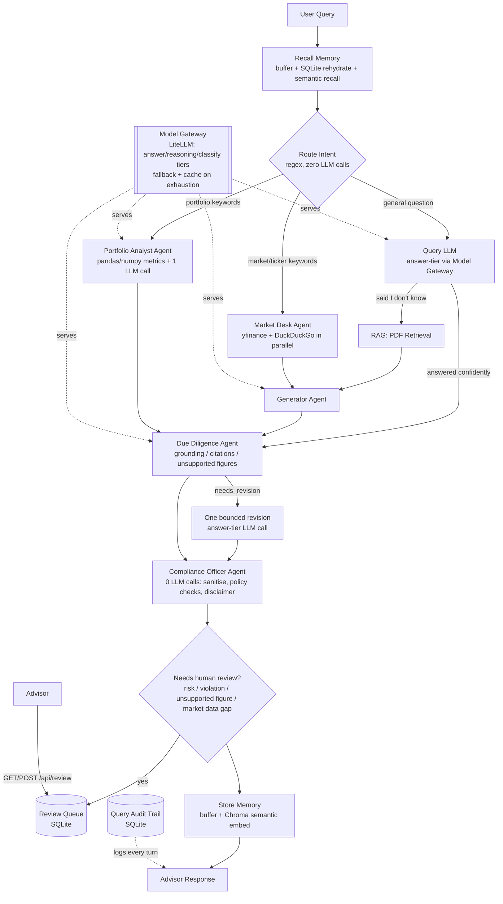

# **TrueWealth AI: Your AI-Powered Financial Strategist**

<p align="center">
  <a href="https://www.python.org/"></a>
  <a href="https://fastapi.tiangolo.com/"></a>
  <a href="https://langchain.com/"></a>
  <a href="https://langchain-ai.github.io/langgraph/"></a>
  <a href="https://groq.com/"></a>
  <a href="https://www.litellm.ai/"></a>
</p>

<p align="center">
  <a href="https://huggingface.co/"></a>
  <a href="https://www.trychroma.com/"></a>
  <a href="https://scikit-learn.org/"></a>
  <a href="https://pandas.pydata.org/"></a>
  <a href="https://numpy.org/"></a>
  <a href="https://www.sqlite.org/"></a>
  <a href="https://sqlmodel.tiangolo.com/"></a>
</p>

<p align="center">
  <a href="https://react.dev/"></a>
  <a href="https://tailwindcss.com/"></a>
  <a href="https://www.docker.com/"></a>
</p>


**TrueWealth AI** lets you chat with an AI financial advisor the way you'd talk to a human one — ask about a stock, your portfolio's risk, or a general investing question, and get a clear answer in seconds. Every answer is fact-checked and compliance-screened before it reaches you, and anything the system itself considers risky is held back for a human expert to sign off on first.

It's an **end-to-end Multi-Agent Financial Advisor AI System** that delivers **reliable, real-time investment insights** by combining **LangGraph-powered orchestration**, multi-tier **LLM reasoning (GPT-OSS-120B, Llama 3.3, and Llama 3.1 via Groq, routed through a LiteLLM gateway)**, and **RAG with ChromaDB + HuggingFace embeddings**. It features **Retriever, Generator, Market Desk, Portfolio Analyst, Due Diligence, Compliance Officer, News, Web Search, and Memory agents**, with a rule-based compliance layer, a single-call hallucination/grounding check, real (pandas/numpy-computed) portfolio risk analysis, and a human-in-the-loop review queue for anything the system itself flags as risky.

Engineered with a **modular, scalable architecture**, it includes a high-performance **FastAPI backend** for agent orchestration, a **React responsive UI (React, Tailwind CSS)** for a premium client experience, and full **Dockerization** for portability. Deployed with a **CI/CD pipeline**, it adheres to enterprise software practices.


<div align="center">
  <video src="https://github.com/user-attachments/assets/ce941c51-aa8e-47b3-8124-02d1b21bd9b7" width="100%" controls>
    Your browser does not support the video tag.
  </video>
</div>
<hr>
<div align="center">
  
</div>
<hr>
<div align="center">
  
</div>

---

## **Live Demo**

Try the real-time TrueWealth AI: [**TrueWealth AI – Click Here**](https://truewealth-ai.onrender.com/)

---

## **Project Structure**
```
TrueWealth-AI/
├── .github/
│   └── workflows/
│       ├── ci.yml              # Backend & Frontend Testing Workflow
│       └── main.yml            # Docker Build & Deployment Workflow
|
├── backend/
│   ├── app/
│   │   ├── agents/                       # Multi-agent Logic
│   │   │   ├── compliance_officer_agent.py # Guardrails: input sanitisation, output policy checks, disclaimer
│   │   │   ├── due_diligence_agent.py    # Grounding / citation / hallucination check + one bounded revision
│   │   │   ├── duckduckgo.py             # Web Search Agent (sequential fallback path)
│   │   │   ├── executor.py               # Retry counter helper (not wired into the graph, kept as-is)
│   │   │   ├── generator.py              # Answer Synthesis Agent
│   │   │   ├── llm.py                    # Direct LLM Query Agent
│   │   │   ├── market_desk_agent.py      # Parallel yfinance news + DuckDuckGo coordinator
│   │   │   ├── memory.py                 # Short-term buffer + SQLite rehydration + semantic recall
│   │   │   ├── planner_agent.py          # Retry-counter reset helper (not wired into the graph, kept as-is)
│   │   │   ├── portfolio_analyst_agent.py # pandas/numpy portfolio + risk metrics, LLM only explains them
│   │   │   ├── rag.py                    # Document Retrieval Agent
│   │   │   └── yfinance.py               # Market News Agent (sequential fallback path)
│   │   ├── core/                         # System Kernels
│   │   │   ├── cache.py                  # TTLCache layers (embeddings, RAG, news, DDG, answers)
│   │   │   ├── config.py                 # Constants, paths, and every env-overridable setting
│   │   │   ├── db.py                     # SQLModel/SQLite audit trail + review queue
│   │   │   ├── logger.py                 # Centralized Logging
│   │   │   ├── resilience.py             # Shared timeout+retry helper for outbound tool calls
│   │   │   ├── review.py                 # Human-review trigger rules
│   │   │   ├── state.py                  # Agentic State Definitions
│   │   │   └── workflow.py               # LangGraph StateGraph + routing logic
│   │   ├── tools/                        # Retrieval & Data Tools
│   │   │   ├── document_loader.py        # PDF Ingestion
│   │   │   ├── llm_client.py             # Groq LLM Client (still used directly by tests/tools)
│   │   │   ├── model_gateway.py          # LiteLLM Groq-tier routing + fallback + resilience cache
│   │   │   ├── search_tools.py           # Search Tool Definitions
│   │   │   └── vector_store.py           # ChromaDB Management (RAG + separate memory collection)
│   │   └── main.py                       # FastAPI Application Entry
│   ├── logs/                             # Persistent runtime & startup logs
│   ├── tests/                            # 100% statement/branch coverage test suite
│   │   ├── conftest.py                   # Mocking Infrastructure
│   │   ├── test_app.py                   # API Endpoint Tests
│   │   ├── test_cache.py
│   │   ├── test_compliance_officer_agent.py
│   │   ├── test_db.py
│   │   ├── test_document_loader.py
│   │   ├── test_duckduckgo_agent.py
│   │   ├── test_due_diligence_agent.py
│   │   ├── test_executor.py
│   │   ├── test_generator_agent.py
│   │   ├── test_llm_agent.py
│   │   ├── test_llm_client.py
│   │   ├── test_logger.py
│   │   ├── test_market_desk_agent.py
│   │   ├── test_memory.py
│   │   ├── test_model_gateway.py
│   │   ├── test_planner.py
│   │   ├── test_portfolio_analyst_agent.py
│   │   ├── test_rag.py
│   │   ├── test_rate_limit.py
│   │   ├── test_review.py
│   │   ├── test_state.py
│   │   ├── test_tool_getters.py
│   │   ├── test_vector_store.py
│   │   ├── test_workflow.py
│   │   └── test_yfinance_agent.py
│   ├── .env.example            # Every env variable, documented with defaults
│   ├── Dockerfile              # Python 3.12 Slim Environment
│   └── requirements.txt        # Pegged Backend Dependencies
|
├── frontend/
│   ├── src/
│   │   ├── api/                # Axios Client for FastAPI
│   │   │   └── client.js
│   │   ├── components/         # Glassmorphic UI Components
│   │   │   ├── ChatInterface.jsx
│   │   │   ├── Sidebar.jsx
│   │   │   ├── StatusBar.jsx
│   │   │   └── WelcomeCard.jsx
│   │   ├── test/               # Vitest Setup
│   │   │   └── setup.js
│   │   ├── App.jsx             # Main Routing & Layout
│   │   ├── index.css           # Tailwind & Glassmorphic Styles
│   │   └── main.jsx             # React Entry Point
│   ├── public/                 # Static Assets
│   ├── Dockerfile              # Node.js 20 Build Environment
│   ├── package.json            # Frontend Dependencies & ESLint
│   ├── tailwind.config.js      # DaisyUI & Theme Config
│   └── vite.config.js          # Vite & Proxy Configuration
|
├── app.png                     # Demo picture
├── app-1.png                   # Demo picture
├── demo.mp4                    # Demo video
├── docker-compose.yml          # Unified Container Orchestration
├── LICENSE                     # MIT License
├── README.md                   # Project Documentation
├── render.yaml                 # Render Deployment Config
├── run.py                      # Unified Local Startup Script
└── setup.py                    # Backend Package Metadata
```

---

## **Features & Functionalities**
|  Step |  Feature                                     |  Tech Stack / Tool Used                                                    |
| ------ | ---------------------------------------------- | ---------------------------------------------------------------------------- |
|   1  |  **LLM-based Financial Query Understanding** | **Groq** + **GPT-OSS-120B**                                                  |
|    2 |  **Professional Tone Personalization**        | **Prompt Engineering** + **Advisor Persona Templates**                       |
|  3   | **RAG-based Financial Answering**           | **LangChain** + **ChromaDB** + **Sentence Transformers**                     |
|  4   |  **Financial Document Retriever Agent**      | **RetrieverAgent** + **Vector Store Search**, cached by index version        |
|  5  | **Answer Generator Agent**                  | **GeneratorAgent** (LLM-based factual + professional financial style)        |
|  6 | **Financial News Retrieval Agent**          | **YahooFinanceNewsTool** (requires the `yfinance` package — see Limitations) |
|  7   | **Web Search Agent (Fallback)**             | **DuckDuckGo Search Tool** (via `ddgs`, see Limitations)                     |
|  8  |  **Deterministic Query Routing**             | Regex-based portfolio/market/general classifier, zero LLM calls              |
|  9  |  **Intelligent Tool Routing & Fallback**     | Conditional branching in the LangGraph StateGraph                            |
|   10  | **Short-Term + Long-Term Conversational Memory** | Recency buffer + SQLite rehydration on restart + Chroma semantic recall  |
| 11 |  **PDF Knowledge Ingestion**                 | **PyPDFLoader** + **RecursiveCharacterTextSplitter**                         |
| 12 |  **Vector Embedding & Storage**              | **HuggingFaceEmbeddings** + **ChromaDB**, cached per-process and per-query   |
| 13 | **State-based Multi-Agent Orchestration**   | **LangGraph StateGraph** + **Conditional Edges** + async nodes for parallel fan-out |
| 14 | **Multi-source Knowledge Fusion**           | **LLM + RAG + Yahoo Finance + DuckDuckGo Combined Answer Synthesis**         |
| 15 | **Market Desk Agent**                       | Parallel (`asyncio.gather`) yfinance news + DuckDuckGo search, per-branch timeout and degradation |
| 16 | **Portfolio Analyst Agent**                 | Real allocation/volatility/drawdown/concentration via **pandas**/**NumPy** + real per-ticker price history; LLM only explains the numbers |
| 17 | **Due Diligence Agent**                     | One structured LLM critique (grounding, citation validity, unsupported figures, revision need) + deterministic pre-checks that can skip it entirely |
| 18 | **Compliance Officer Agent**                | Zero-LLM-call input sanitisation + output policy checks (guaranteed-returns language, unhedged directives, PII, unsourced figures, mandatory disclaimer) |
| 19 | **Model Gateway**                           | **LiteLLM**-routed Groq model tiers (answer/reasoning/classify) with rate-limit-aware fallback and short-lived response cache |
| 20 | **Human Review Queue**                      | SQLite-backed queue flagged by risk/compliance/degradation, `GET`/`POST /api/review` |
| 21 | **Query Audit Trail**                       | SQLModel/SQLite log of every query: source, agents run, latency, tokens, model, degradation |
| 22 | **Response & Retrieval Caching**            | `cachetools.TTLCache` layers per data type, with a correctness rule excluding live market data |
| 23 | **API Rate Limiting**                       | `slowapi`, keyed on `X-Forwarded-For`, configurable/disableable                |
| 24 | **API Development & Hosting**               | **FastAPI** (High-performance asynchronous endpoints)                        |
| 25 | **Modular Code Architecture**               | **Separation of Concerns** + **Service/Agent Modules**                       |
| 26 | **Responsive Premium UI**                   | **Vite + React** + **Tailwind CSS + DaisyUI**                                |
| 27 | **Cloud Deployment**                        | **Render** (Production hosting)                                              |
| 28 | **CI/CD Pipeline**                          | **GitHub Actions** (Automated Testing & Docker Deployment)                   |
| 29 | **Containerization for Portability**        | **Docker** (Multi-stage builds for Backend & Frontend)                        |

---

## **Performance Metrics**

Measured this session with a real Groq API key against the live `/api/chat` endpoint — **not** a simulated or mocked benchmark. Sample size is small (15 queries, one process) and reported as such rather than dressed up as a large-scale study.

| Metric                          | Value      | Notes |
|----------------------------------|------------|-------|
| Mean latency (all 15 queries)     | 5.91s      | Includes one cold-start query that pays a one-time embedding-model load |
| P95 latency (all 15 queries)      | 18.51s     | Driven by the market-desk queries below, not the LLM calls |
| Min / Max                         | 0.99s / 23.96s | |
| — General/definitional questions (9 of 15) | ~1.39s mean (excl. cold start) | `llm_knowledge` path: one Groq call, due diligence usually skipped since there's nothing to verify |
| — Market-desk questions (4 of 15) | ~15.56s mean | Real Yahoo Finance + DuckDuckGo network calls in parallel; yfinance's news fetch alone has been observed between 4s and 20s+ |
| — Portfolio questions (2 of 15)   | ~2.23s mean | Real per-ticker `yfinance` price history fetch + one LLM call to explain the computed numbers |
| Backend test coverage             | 100% statements, 100% branches | 135 tests, `pytest --cov=app --cov-branch`, no real network/LLM calls |
| Frontend test coverage            | 77.23% statements/lines, 80.55% branch, 47.36% functions | 5 tests, `vitest --coverage`; not chased to 100% this session |

**Caching, isolated from network variance** (mocked calls, so this measures the mechanism, not the internet):
- Answer cache hit vs. a real Groq call: **2.96s → 0.0119s (~250x)**
- RAG retrieval cache hit vs. cold retrieval (embedding load + similarity search): **7.4s → 0.00002s**
- Market-desk parallel fan-out vs. sequential (2 mocked 2s branches): **4.01s → 2.01s (2.00x)**, matching theory for two equal-latency branches

---

## **System Architecture**



---

## **API Endpoints**

| Endpoint | Method | Rate limit | Cache behavior | Notes |
|---|---|---|---|---|
| `/api/chat` | POST | 20/min (configurable, `X-Forwarded-For`-aware) | Answer cached unless the source drew on live market data (`yfinance`, `market_desk`, `portfolio_analysis`) | Accepts an optional `portfolio: [{ticker, shares}]` field; response gains `degraded`, `compliance`, `verification`, `portfolio_analysis` fields (all additive, existing fields unchanged) |
| `/api/health` | GET | none | none | Unchanged |
| `/api/history` | GET | none | none | Paginated (`limit`, `offset`) query audit log |
| `/api/stats` | GET | none | none | Aggregates: latency, degradation/fallback/compliance/high-risk counts, source and model breakdowns, review queue counts, human agreement rate |
| `/api/review` | GET | none | none | Paginated human review queue (`limit`, `offset`, `status`); **unauthenticated** |
| `/api/review/{id}` | POST | 20/min | n/a | Records a human verdict (`approved`/`rejected`/`needs_correction`) alongside the model's original answer, never overwriting it; **unauthenticated** |

---

## **Technical Infrastructure**

### **1. Testing & Reliability**
The project runs 135 backend tests at 100% statement and branch coverage, and 5 frontend tests, none of which touch the real network, a real LLM, or load real model weights.

#### **Backend Tests (Pytest)**

- **Run all tests**:
  ```bash
  cd backend
  pytest
  ```
- **Run with coverage**:
  ```bash
  pytest --cov=app --cov-branch --cov-report=term-missing tests/
  ```

#### **Frontend Tests (Vitest)**
Component-level and integration tests using Vitest and React Testing Library.
- **Run tests**:
  ```bash
  cd frontend
  npm test
  ```
- **Run with coverage**:
  ```bash
  npx vitest run --coverage
  ```
- **Run linter**:
  ```bash
  npm run lint
  ```

### **2. Docker & Deployment**
TrueWealth AI is fully containerized for consistent deployment across environments.

#### **Docker Usage**
- **Unified Launch**: Build and start both backend and frontend services using Docker Compose.
  ```bash
  docker-compose up --build
  ```
- **Persistent Logs**: Application logs are automatically mapped to the host's `backend/logs/` directory for persistence across container restarts.

#### **Multi-Stage Builds**
- **Backend Dockerfile**: Optimized Python 3.12 slim image.
- **Frontend Dockerfile**: Multi-stage build that compiles React via Node.js and serves the production build.

### **3. CI/CD Lifecycle**
GitHub Actions handles the full lifecycle:
1. **CI**: Linting and tests are run on every pull request.
2. **CD**: On successful merge to `main`, Docker images are rebuilt and deployed to **Render**.

---

## **Getting Started**

### **Prerequisites**
- Python 3.12+
- Node.js 20+
- Groq API Key

### **Local Setup**
1. **Clone & Explore**:
   ```bash
   git clone https://github.com/Md-Emon-Hasan/TrueWealth-AI.git
   cd TrueWealth-AI
   ```
2. **Environment**:
   Copy `backend/.env.example` to `backend/.env` and set your `GROQ_API_KEY`. Everything else in that file is optional and defaults sensibly.
3. **Launch**:
   ```bash
   python run.py
   ```
   - UI: `http://localhost:3000`
   - API Docs: `http://localhost:5001/docs`

---

## **Limitations**

- **The model gateway's fallback chain covers Groq model throttling, not provider outage.**
- **Every due-diligence and compliance threshold is an unvalidated starting point**
- **`yfinance` (both the news tool and the price-history fetch used by Portfolio Analyst) is an unofficial Yahoo Finance scraper with no SLA and no official support.**
- **DuckDuckGo search depends on the `ddgs` package**

---

## **Developer**
**Md Emon Hasan**  
- **Email:** [emon.mlengineer@gmail.com](mailto:emon.mlengineer@gmail.com)  
- **Portfolio:** [Md-Emon-Hasan](https://emonlabs-ai.hitechparks.com/)  
- **WhatsApp:** [+8801834363533](https://wa.me/8801834363533)  
- **GitHub:** [Md-Emon-Hasan](https://github.com/Md-Emon-Hasan)  
- **LinkedIn:** [Md Emon Hasan](https://www.linkedin.com/in/md-emon-hasan-695483237/)  
- **Facebook:** [Md Emon Hasan](https://www.facebook.com/mdemon.hasan2001/)
