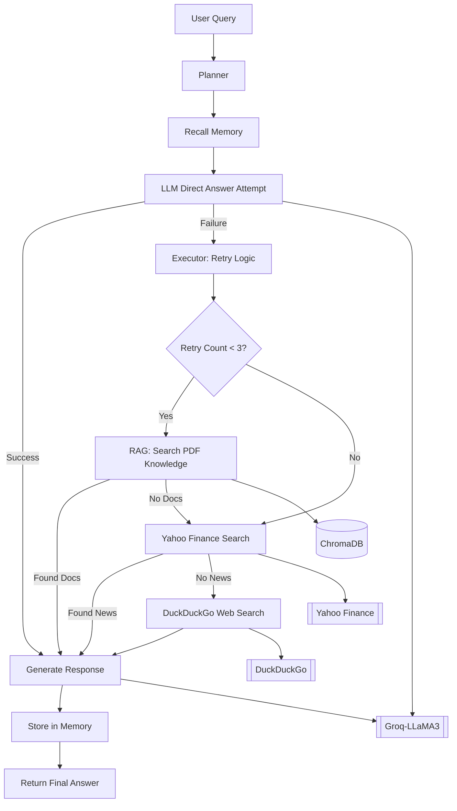

# **💼 TrueWealth AI: Your Smart Path to Financial Freedom**

[](https://github.com/user-attachments/assets/4e411f0e-500a-4e8b-819a-8d6ccf701c3b)

---

## Project Overview
**TrueWealth AI** is an advanced, AI-powered financial advisor that uses cutting-edge technologies in machine learning, natural language processing (NLP), and document retrieval. By leveraging advanced LLMs, real-time data access from financial tools like Yahoo Finance, DuckDuckGo, and dynamic document retrieval systems like LangChain and ChromaDB, it provides personalized financial advice. The system is designed to simulate a real-world financial advisor, offering clear, insightful, and actionable recommendations.

---

## 🚀 Live Demo

🎯 Try the real-time TrueWealth AI:  
👉 [**TrueWealth AI – Click Here**](https://truewealth-ai.onrender.com/)

---

## Real-World Use Cases

#### **1. Personal Financial Advisory**
- Helps **individual investors** make informed decisions on stocks, bonds, and long-term investments.

#### **2. Financial Education & Self-Learning**
- Acts as a **tutor** for users reading financial books (e.g., *The Intelligent Investor*).

#### **3. Real-Time Market & News Analysis**
- Provides **up-to-date financial news** from Yahoo Finance.

#### **4. Small Business Financial Consulting**
- Assists **small business owners** in budgeting, tax planning, and investment decisions.

#### **5. Retirement & Wealth Management**
- Offers **retirement planning insights** (e.g., 401(k), Roth IRA strategies).

---

## **Features & Functionalities**

| ✅ Step | 🧠 Feature                           | ⚙️ Tech Stack / Tool Used                                       |
| ------ | ------------------------------------ | --------------------------------------------------------------- |
| 1️⃣    | 🧠 **LLM-based Query Understanding** | **Groq**                                                      |
| 2️⃣    | ✨ **Tone Personalization**           | **Prompt Engineering** + **Persona Templates**                  |
| 3️⃣    | 📚 **RAG-based Answering**           | **LangChain** + **ChromaDB** + **Sentence Transformers**        |
| 4️⃣    | 🔍 **Retrieval Agent**               | **RetrieverAgent** + **Vector Store Tools**                     |
| 5️⃣    | 🧠 **Answer Generator Agent**        | **GeneratorAgent** (LLM-based factual + human-style)            |
| 6️⃣    | 🧾 **Document QA Agent**             | **DocumentReaderAgent** + **QA Chain**                          |
| 7️⃣    | 🔁 **ToolRouter Agent**              | **Conditional Logic** + **Tool Selection**                      |
| 8️⃣    | 🧠 **Planner Agent**                 | **LangGraph Planner Node**                                      |
| 9️⃣     | 🔄 **Intelligent Tool Routing**      | **Retry Logic** + **Fallback Tool** + **Score-based Selection** |
| 🔟 | 🧠 **Short Conversational Memory**   | **LangGraph Memory Integration (short-term)**                   |

---

## Project Structure
```
TrueWealth AI/
├── streamlit_app.py               # Streamlit-based user interface for financial advisor chatbot
├── notebook/
│   └── experiment.ipynb           # Jupyter notebook for prototyping, experimentation, and testing
├── agents/
│   ├── __init__.py                # Package initializer for agents module
│   ├── nodes.py                   # LangGraph nodes: agent planner, tool-caller, executor logic
│   ├── state.py                   # Agent state and memory management during graph execution
│   └── workflow.py                # LangGraph planner + executor orchestration for agent workflow
├── data/
│   └── The Intelligent Investor - BENJAMIN GRAHAM.pdf   # Sample financial PDF for RAG ingestion
├── finance_db/
│   └── (SQLite/Postgres DB files) # Local or remote finance database to store processed data
├── ingestion/
│   └── pdf_loader.py              # Document ingestion module: PDF parsing, metadata extraction, RAG prep
├── utils/
│   ├── __init__.py                # Package initializer for utility functions
│   └── memory.py                  # Short-term memory store (e.g., Chroma, JSON memory, etc.)
├── logs/
│   └── advisor.log                # Logging outputs for all conversations, errors, or tool executions
├── tests/
│   ├── __init__.py                # Package initializer for test suite
│   └── test_app.py                # Unit tests for core application components (agents, tools, API, etc.)
├── retrieval/
│   ├── __init__.py                # Package initializer for retrieval modules
│   ├── retrievers.py              # Top-K retrievers using vector similarity (e.g., Chroma, FAISS)
│   ├── splitter.py                # PDF/document chunking logic (e.g., RecursiveTextSplitter)
│   └── vectorstore.py             # Vectorstore logic using HuggingFace embeddings + ChromaDB
├── logger.py                      # Logger configuration for debug/info/error handling across modules
├── config.py                      # Centralized config: API keys, constants, paths, env vars (via dotenv)
├── main.py                        # run file for muduler package
├── setup.py                       # Package metadata and install dependencies (for pip install)
├── fastapi_app.py                 # FastAPI app serving REST endpoints for backend API integration
├── app.png
├── .gitignore                     # Files/folders ignoredetc.)
├── Dockerfile                     # Docker image definition for containerizing the full app
├── .github/
│   └── workflows/
│       └── ci.yml                 # GitHub Actions workflow for CI/CD: linting, tests, deploy
├── requirements.txt               # Dependency list for pip install (FastAPI, LangChain, etc.)
├── LICENSE
├── README.md                      # Project overview, setup instructions, features, architecture diagram
```

---

## System Architecture



---

## **Backend with FastAPI**

FastAPI serves as the backend for managing API requests, handling the communication between the UI and the core financial advisory logic.

### **Other Features**:

* **Fast API Endpoints**: API routes are built to handle financial queries, document retrieval requests, and personalized recommendations.
* **Asynchronous Processing**: Supports asynchronous task handling for document retrieval and large LLM query processing.
* **Integration with LangChain and RAG Pipeline**: FastAPI integrates directly with LangChain and RAG to provide on-demand data fetching and query answering.

---

## **Deployment Process with Docker**

### **Dockerization**:

1. **Service Containerization**: The entire TrueWealth AI system is broken down into microservices, each housed within its own Docker container.
2. **Docker Compose**: Used to coordinate and manage multi-container services for local development and testing.

### **Deployment Steps**:

1. **Build Docker Image**:

   ```bash
   docker build -t truewealth-ai .
   ```
2. **Run Application in Docker**:

   ```bash
   docker-compose up --build
   ```

---

## **CI/CD Pipeline**

Continuous Integration and Continuous Deployment (CI/CD) is implemented using **GitHub Actions** to automate testing, building, and deploying the project.

### **CI/CD Features**:

* **Automated Testing**: Every code push triggers automated unit and integration tests.
* **Automated Deployment**: Successful builds are automatically deployed to production or staging environments.

---

## **Future Enhancements**

* **Multilingual Support**: Future iterations will include multilingual capabilities to cater to a global client base.
* **Advanced Financial Analytics**: Integration with more sophisticated financial forecasting models and real-time market analysis.
* **Long-Term Memory**: Extended memory for better long-term personalized financial advice.

---

## **Personal Information**

* **Developer:** Md Emon Hasan
* **GitHub:** [Md-Emon-Hasan](https://github.com/Md-Emon-Hasan)
* **LinkedIn:** [Md Emon Hasan](https://www.linkedin.com/in/md-emon-hasan-695483237/)
* **Email:** [iconicemon01@gmail.com](mailto:iconicemon01@gmail.com)
* **WhatsApp:** [+8801834363533](https://wa.me/8801834363533)

---