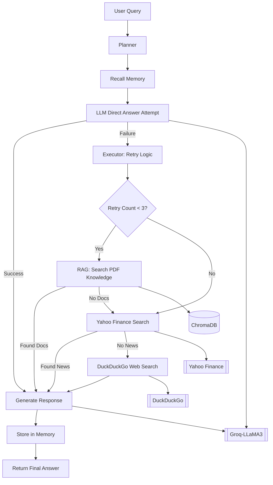

# **💼 TrueWealth AI: Your AI-powered financial strategist**

[](https://github.com/user-attachments/assets/0cab61d6-0b2e-4c17-8400-ceebcfb1bd05)

---

## **Project Overview**

**TrueWealth AI** is a **end-to-end Multi-Agent Financial Advisor AI System** that combines **LangGraph-powered orchestration**, advanced **LLM reasoning (LLaMA-3 via Groq)**, and **RAG with ChromaDB + HuggingFace embeddings** to deliver professional, context-aware financial insights. The system features **Planner, Retriever, Generator, News, Web Search, and Memory agents** with intelligent **tool routing, retry logic, and multi-source knowledge fusion** for high accuracy and reliability. It supports **PDF ingestion, financial news retrieval, and fallback web search** to ensure comprehensive answers. Built with a **modular architecture** for scalability, it provides **FastAPI APIs** for testing, a **Flask-based responsive UI (HTML, CSS, JS)** for client interaction, and is fully **Dockerized** for portability. Deployed on **Render** with an integrated **CI/CD pipeline**, it reflects enterprise-level engineering practices, making it a **industry-grade AI solution** ready for real-world deployment.

---

## 🚀 **Live Demo**

🎯 Try the real-time TrueWealth AI:  
👉 [**TrueWealth AI – Click Here**](https://truewealth-ai.onrender.com/)

---

## **Real-World Use Cases**

##### **1. Personal Financial Advisory**
- Helps **individual investors** make informed decisions on stocks, bonds, and long-term investments.

##### **2. Financial Education & Self-Learning**
- Acts as a **tutor** for users reading financial books (e.g., *The Intelligent Investor*).

##### **3. Real-Time Market & News Analysis**
- Provides **up-to-date financial news** from Yahoo Finance.

##### **4. Small Business Financial Consulting**
- Assists **small business owners** in budgeting, tax planning, and investment decisions.

##### **5. Retirement & Wealth Management**
- Offers **retirement planning insights** (e.g., 401(k), Roth IRA strategies).

---

## **Features & Functionalities**
| ✅ Step | 🧠 Feature                                     | ⚙️ Tech Stack / Tool Used                                                    |
| ------ | ---------------------------------------------- | ---------------------------------------------------------------------------- |
| 1️⃣    | 🧠 **LLM-based Financial Query Understanding** | **Groq** + **LLaMA-3**                                                       |
| 2️⃣    | ✨ **Professional Tone Personalization**        | **Prompt Engineering** + **Advisor Persona Templates**                       |
| 3️⃣    | 📚 **RAG-based Financial Answering**           | **LangChain** + **ChromaDB** + **Sentence Transformers (all-MiniLM-L6-v2)**  |
| 4️⃣    | 🔍 **Financial Document Retriever Agent**      | **RetrieverAgent** + **Vector Store Search**                                 |
| 5️⃣    | 🧠 **Answer Generator Agent**                  | **GeneratorAgent** (LLM-based factual + professional financial style)        |
| 6️⃣    | 📰 **Financial News Retrieval Agent**          | **YahooFinanceNewsTool**                                                     |
| 7️⃣    | 🌐 **Web Search Agent (Fallback)**             | **DuckDuckGo Search Tool**                                                   |
| 8️⃣    | 🧠 **Planner Agent**                           | **LangGraph Planner Node**                                                   |
| 9️⃣    | 🔄 **Intelligent Tool Routing & Fallback**     | **Retry Logic** + **Conditional Branching** + **Multi-step Tool Selection**  |
| 🔟     | 🧠 **Short-Term Conversational Memory**        | **LangGraph Memory Integration (Buffer-based)**                              |
| 1️⃣1️⃣ | 📂 **PDF Knowledge Ingestion**                 | **PyPDFLoader** + **RecursiveCharacterTextSplitter**                         |
| 1️⃣2️⃣ | 📊 **Vector Embedding & Storage**              | **HuggingFaceEmbeddings** + **ChromaDB**                                     |
| 1️⃣3️⃣ | ⚙️ **State-based Multi-Agent Orchestration**   | **LangGraph StateGraph** + **Conditional Edges** + **Dynamic State Updates** |
| 1️⃣4️⃣ | 🗂 **Multi-source Knowledge Fusion**           | **LLM + RAG + Yahoo Finance + DuckDuckGo Combined Answer Synthesis**         |
| 1️⃣5️⃣ | 🧪 **API Testing & Integration**               | **FastAPI** (API endpoints for agent orchestration testing)                  |
| 1️⃣6️⃣ | 🗃 **Modular Code Architecture**               | **Separation of Concerns** + **Service/Agent Modules**                       |
| 1️⃣7️⃣ | 💻 **Responsive Web UI**                       | **Flask** + **HTML5, CSS3, JavaScript**                                      |
| 1️⃣8️⃣ | 🌐 **Cloud Deployment**                        | **Render** (Production hosting)                                              |
| 1️⃣9️⃣ | 🔄 **CI/CD Pipeline**                          | **GitHub Actions** / **CI/CD Workflows**                                     |
| 2️⃣0️⃣ | 📦 **Containerization for Portability**        | **Docker** (App + Dependencies + Environment)                                |

---

## **Project Structure**
```
TrueWealth AI/
   │
   ├── .github/
   │   └── workflows/
   │       └── main.yml
   │
   ├── agents/
   │   ├── __init__.py
   │   ├── duckduckgo.py
   │   ├── executor.py
   │   ├── generator.py
   │   ├── llm.py
   │   ├── memory_store.py
   │   ├── memory.py
   │   ├── planner.py
   │   ├── rag.py
   │   └── yfinance.py
   │
   ├── core/
   │   ├── __init__.py
   │   ├── config.py
   │   ├── state.py
   │   └── workflow.py
   │
   ├── data/
   │   └── The Intelligent Investor - BENJAMIN GRAHAM.pdf
   │
   ├──finance_db/
   │   └── chroma.sqlite3
   │
   ├── notebook/
   │   └── experiment.ipynb
   │
   ├── static/
   │   ├── css/
   │   │   └── style.css
   │   ├── images/
   │   │   └── logo.png
   │   └── js/
   │       └── script.js
   │
   ├── templates/
   │   └── index.html
   │
   ├── tests/
   │   └── test_app.py
   │
   ├── tools/
   │   ├── __init__.py
   │   ├── document_loader.py
   │   ├── llm_client.py
   │   ├── search_tools.py
   │   └── vector_store.py
   │
   ├── .gitignore
   ├── api.py
   ├── app.py
   ├── app.png
   ├── demo.mp4
   ├── Dockerfile
   ├── LICENSE
   ├── main.py
   ├── README.md
   ├── render.yaml
   ├── requirements.txt
   └── setup.py
```

---

## **System Architecture**



---

## **FastAPI Endpoints**

#### **POST /chat**

Process a financial question and return an AI-generated response with source information.

**Request:**

```
POST /chat HTTP/1.1  
Content-Type: application/json  
Host: localhost:8000  

{
  "message": "What are the top performing stocks this week?",
  "session_id": "optional_existing_id"
}
```

**Parameters:**

* `message` (**required**) → The financial question to process
* `session_id` (**optional**) → Existing session ID for context continuity (default: `"default"`)

**Response:**

```json
{
  "response": "Based on Yahoo Finance data, the top performing stocks this week are...",
  "session_id": "20250813123045",
  "source": "YahooFinance"
}
```

**Status Codes:**

* `200` → Successful response
* `400` → Invalid request (missing `message`)
* `500` → Internal server error

---

## **Deployment Process with Docker**

#### **Dockerization**:

1. **Service Containerization**: The entire TrueWealth AI system is broken down into microservices, each housed within its own Docker container.
2. **Docker Compose**: Used to coordinate and manage multi-container services for local development and testing.

#### **Deployment Steps**:

1. **Build Docker Image**:

   ```bash
   docker build -t truewealth-ai .
   ```
2. **Run Application in Docker**:

   ```bash
   docker-compose up --build
   ```

---

## **CI/CD Pipeline**

Continuous Integration and Continuous Deployment (CI/CD) is implemented using **GitHub Actions** to automate testing, building, and deploying the project.

#### **CI/CD Features**:

* **Automated Testing**: Every code push triggers automated unit and integration tests.
* **Automated Deployment**: Successful builds are automatically deployed to production or staging environments.

---

## **Future Enhancements**

* **Multilingual Support**: Future iterations will include multilingual capabilities to cater to a global client base.
* **Advanced Financial Analytics**: Integration with more sophisticated financial forecasting models and real-time market analysis.
* **Long-Term Memory**: Extended memory for better long-term personalized financial advice.

---

## **Personal Information**

* **Developer:** Md Emon Hasan
* **GitHub:** [Md-Emon-Hasan](https://github.com/Md-Emon-Hasan)
* **LinkedIn:** [Md Emon Hasan](https://www.linkedin.com/in/md-emon-hasan-695483237/)
* **Email:** [iconicemon01@gmail.com](mailto:iconicemon01@gmail.com)
* **WhatsApp:** [+8801834363533](https://wa.me/8801834363533)

---