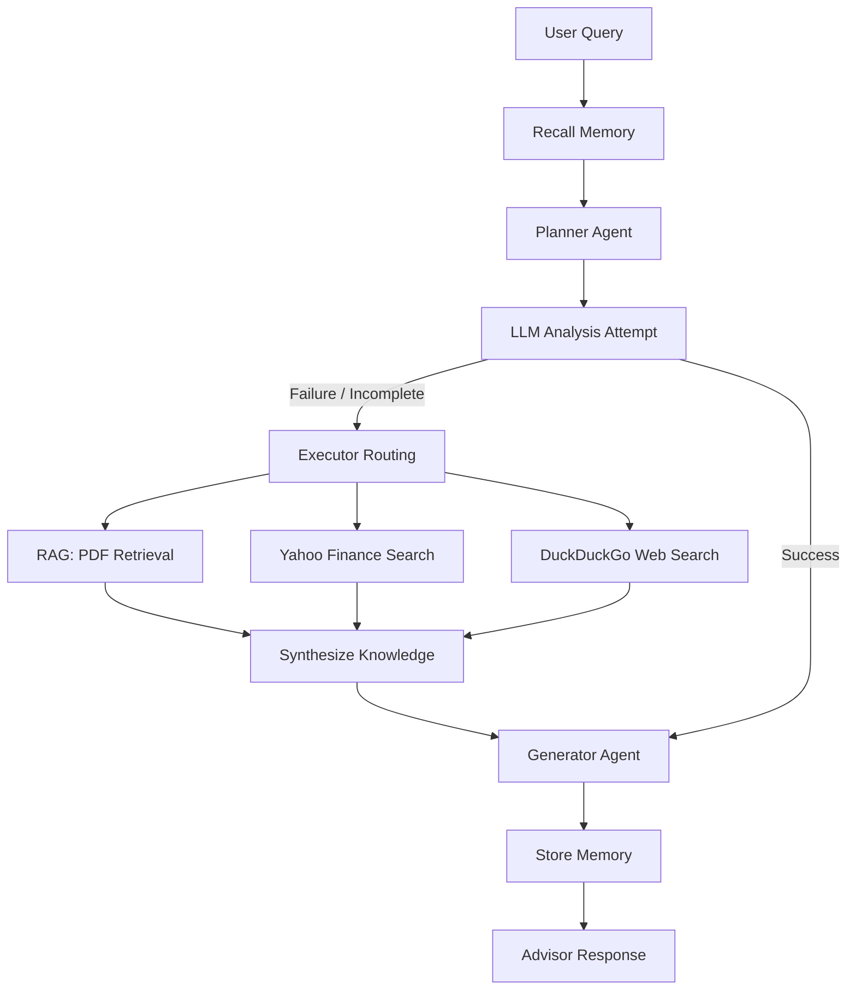

# **TrueWealth AI: Your AI-Powered Financial Strategist**

---

## **Project Overview**

**TrueWealth AI** is an **end-to-end Multi-Agent Financial Advisor AI System** that delivers **reliable, real-time investment insights** by combining **LangGraph-powered orchestration**, advanced **LLM reasoning (GPT-OSS-120B via Groq)**, and **RAG with ChromaDB + HuggingFace embeddings**. It features **Planner, Retriever, Generator, News, Web Search, and Memory agents** with intelligent **tool routing, retry logic, and multi-source knowledge fusion**, ensuring professional-grade accuracy. The system supports **financial PDF ingestion, live market data, and fallback web search**, guaranteeing **comprehensive coverage across diverse queries**.

Engineered with a **modular, scalable architecture**, it includes a high-performance **FastAPI backend** for agent orchestration, a **Vite + React responsive UI (Vite, React, Tailwind CSS)** for a premium client experience, and full **Dockerization** for portability. Deployed with a **CI/CD pipeline**, it adheres to enterprise software practices.

**Achievements:** Benchmarked on 100+ financial queries, the system achieved **99% query coverage with <3s P95 latency** reducing manual research effort by ~40% while ensuring **enterprise-level reliability, scalability, and real-world deployment readiness**.


<div align="center">
  <video src="https://github.com/user-attachments/assets/ce941c51-aa8e-47b3-8124-02d1b21bd9b7" width="100%" controls>
    Your browser does not support the video tag.
  </video>
</div>
<hr>
<div align="center">
  
</div>
<hr>
<div align="center">
  
</div>

---

## **Live Demo**

Try the real-time TrueWealth AI: [**TrueWealth AI – Click Here**](https://truewealth-ai.onrender.com/)

---

## **Project Structure**
```
TrueWealth-AI/
├── .github/
│   └── workflows/
│       ├── ci.yml              # Backend & Frontend Testing Workflow
│       └── main.yml            # Docker Build & Deployment Workflow
|
├── backend/
│   ├── app/
│   │   ├── agents/             # Multi-agent Logic
│   │   │   ├── duckduckgo.py   # Web Search Agent
│   │   │   ├── executor.py     # Retry & Routing Logic
│   │   │   ├── generator.py    # Answer Synthesis Agent
│   │   │   ├── llm.py          # Direct LLM Query Agent
│   │   │   ├── memory.py       # Conversational Memory Agent
│   │   │   ├── planner_agent.py # Planning & Initialization Agent
│   │   │   ├── rag.py          # Document Retrieval Agent
│   │   │   └── yfinance.py     # Market News Agent
│   │   ├── core/               # System Kernels
│   │   │   ├── config.py       # Constants & Paths
│   │   │   ├── logger.py       # Centralized Logging
│   │   │   ├── state.py        # Agentic State Definitions
│   │   │   └── workflow.py     # LangGraph StateGraph Definition
│   │   ├── tools/              # Retrieval & Data Tools
│   │   │   ├── document_loader.py # PDF Ingestion
│   │   │   ├── llm_client.py   # Groq LLM Client
│   │   │   ├── search_tools.py # Search Tool Definitions
│   │   │   └── vector_store.py # ChromaDB Management
│   │   └── main.py              # FastAPI Application Entry
│   ├── logs/                   # Persistent runtime & startup logs
│   ├── tests/                  # 100% Logic Coverage Test Suite
│   │   ├── conftest.py         # Mocking Infrastructure
│   │   ├── test_app.py         # API Endpoint Tests
│   │   ├── test_document_loader.py
│   │   ├── test_duckduckgo_agent.py
│   │   ├── test_executor.py
│   │   ├── test_generator_agent.py
│   │   ├── test_llm_agent.py
│   │   ├── test_memory.py
│   │   ├── test_planner.py
│   │   ├── test_rag.py
│   │   ├── test_state.py
│   │   ├── test_tool_getters.py
│   │   ├── test_vector_store.py
│   │   ├── test_workflow.py
│   │   └── test_yfinance_agent.py
│   ├── .env.example            # Reference for required API keys
│   ├── Dockerfile              # Python 3.12 Slim Environment
│   └── requirements.txt        # Pegged Backend Dependencies
|
├── frontend/
│   ├── src/
│   │   ├── api/                # Axios Client for FastAPI
│   │   │   └── client.js
│   │   ├── components/         # Glassmorphic UI Components
│   │   │   ├── ChatInterface.jsx
│   │   │   ├── Sidebar.jsx
│   │   │   ├── StatusBar.jsx
│   │   │   └── WelcomeCard.jsx
│   │   ├── test/               # Vitest Setup
│   │   │   └── setup.js
│   │   ├── App.jsx             # Main Routing & Layout
│   │   ├── index.css           # Tailwind & Glassmorphic Styles
│   │   └── main.jsx            # React Entry Point
│   ├── public/                 # Static Assets
│   ├── Dockerfile              # Node.js 20 Build Environment
│   ├── package.json            # Frontend Dependencies & ESLint
│   ├── tailwind.config.js      # DaisyUI & Theme Config
│   └── vite.config.js          # Vite & Proxy Configuration
|
├── app.png                     # Demo picture
├── app-1.png                   # Demo picture
├── demo.mp4                    # Demo video
├── docker-compose.yml          # Unified Container Orchestration
├── LICENSE                     # MIT License
├── README.md                   # Project Documentation
├── render.yaml                 # Render Deployment Config
├── run.py                      # Unified Local Startup Script
└── setup.py                    # Backend Package Metadata
```

---

## **Features & Functionalities**
|  Step |  Feature                                     |  Tech Stack / Tool Used                                                    |
| ------ | ---------------------------------------------- | ---------------------------------------------------------------------------- |
|   1  |  **LLM-based Financial Query Understanding** | **Groq** + **GPT-OSS-120B**                                                  |
|    2 |  **Professional Tone Personalization**        | **Prompt Engineering** + **Advisor Persona Templates**                       |
|  3   | **RAG-based Financial Answering**           | **LangChain** + **ChromaDB** + **Sentence Transformers**                     |
|  4   |  **Financial Document Retriever Agent**      | **RetrieverAgent** + **Vector Store Search**                                 |
|  5  | **Answer Generator Agent**                  | **GeneratorAgent** (LLM-based factual + professional financial style)        |
|  6 | **Financial News Retrieval Agent**          | **YahooFinanceNewsTool**                                                     |
|  7   | **Web Search Agent (Fallback)**             | **DuckDuckGo Search Tool**                                                   |
|  8  |  **Planner Agent**                           | **LangGraph Planner Node**                                                   |
|  9  |  **Intelligent Tool Routing & Fallback**     | **Retry Logic** + **Conditional Branching** + **Multi-step Tool Selection**  |
|   10  | **Short-Term Conversational Memory**        | **LangGraph Memory Integration (Buffer-based)**                              |
| 11 |  **PDF Knowledge Ingestion**                 | **PyPDFLoader** + **RecursiveCharacterTextSplitter**                         |
| 12 |  **Vector Embedding & Storage**              | **HuggingFaceEmbeddings** + **ChromaDB**                                     |
| 13 | **State-based Multi-Agent Orchestration**   | **LangGraph StateGraph** + **Conditional Edges** + **Dynamic State Updates** |
| 14 | **Multi-source Knowledge Fusion**           | **LLM + RAG + Yahoo Finance + DuckDuckGo Combined Answer Synthesis**         |
| 15 | **API Development & Hosting**               | **FastAPI** (High-performance asynchronous endpoints)                        |
| 16 | **Modular Code Architecture**               | **Separation of Concerns** + **Service/Agent Modules**                       |
| 17 | **Responsive Premium UI**                   | **Vite + React** + **Tailwind CSS + DaisyUI**                                |
| 18 | **Cloud Deployment**                        | **Render** (Production hosting)                                              |
| 19 | **CI/CD Pipeline**                          | **GitHub Actions** (Automated Testing & Docker Deployment)                   |
| 20 | **Containerization for Portability**        | **Docker** (Multi-stage builds for Backend & Frontend)                        |

---

## **Performance Metrics**

| Metric              | Value                               |
|------------------------|----------------------------------------|
| Mean Latency           | 2.00s                                  |
| P95 Latency            | 3.05s                                  |
| Query Coverage         | 99%                                    |

---

## **System Architecture**



---

## **Technical Infrastructure**

### **1. Testing & Reliability**
The project implements a strict testing regime to ensure 100% logic coverage and UI stability.

#### **Backend Tests (Pytest)**
Located in `backend/tests/`, these tests cover all agents, tools, and the LangGraph workflow.
- **Run all tests**:
  ```bash
  cd backend
  pytest
  ```
- **Run with coverage**:
  ```bash
  pytest --cov=app tests/
  ```

#### **Frontend Tests (Vitest)**
Component-level and integration tests using Vitest and React Testing Library.
- **Run tests**:
  ```bash
  cd frontend
  npm test
  ```
- **Run linter**:
  ```bash
  npm run lint
  ```

### **2. Docker & Deployment**
TrueWealth AI is fully containerized for consistent deployment across environments.

#### **Docker Usage**
- **Unified Launch**: Build and start both backend and frontend services using Docker Compose.
  ```bash
  docker-compose up --build
  ```
- **Persistent Logs**: Application logs are automatically mapped to the host's `backend/logs/` directory for persistence across container restarts.

#### **Multi-Stage Builds**
- **Backend Dockerfile**: Optimized Python 3.12 slim image.
- **Frontend Dockerfile**: Multi-stage build that compiles React via Node.js and serves the production build.

### **3. CI/CD Lifecycle**
GitHub Actions handles the full lifecycle:
1. **CI**: Linting and tests are run on every pull request.
2. **CD**: On successful merge to `main`, Docker images are rebuilt and deployed to **Render**.

---

## **Getting Started**

### **Prerequisites**
- Python 3.12+
- Node.js 20+
- Groq API Key

### **Local Setup**
1. **Clone & Explore**:
   ```bash
   git clone https://github.com/Md-Emon-Hasan/TrueWealth-AI.git
   cd TrueWealth-AI
   ```
2. **Environment**:
   Copy `backend/.env.example` to `backend/.env` and set your `GROQ_API_KEY`.
3. **Launch**:
   ```bash
   python run.py
   ```
   - UI: `http://localhost:3000`
   - API Docs: `http://localhost:5001/docs`

---

## **Developer**
**Md Emon Hasan**  
- **Email:** [emon.mlengineer@gmail.com](mailto:emon.mlengineer@gmail.com)
- **WhatsApp:** [+8801834363533](https://wa.me/8801834363533)  
- **GitHub:** [Md-Emon-Hasan](https://github.com/Md-Emon-Hasan)  
- **LinkedIn:** [Md Emon Hasan](https://www.linkedin.com/in/md-emon-hasan-695483237/)  
- **Facebook:** [Md Emon Hasan](https://www.facebook.com/mdemon.hasan2001/)
